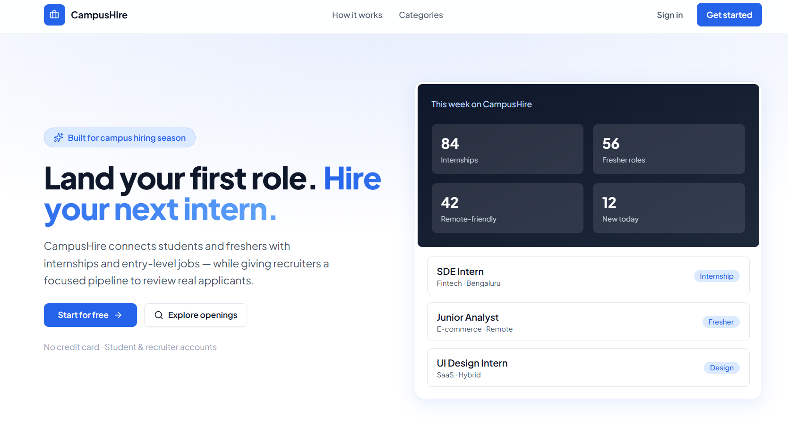
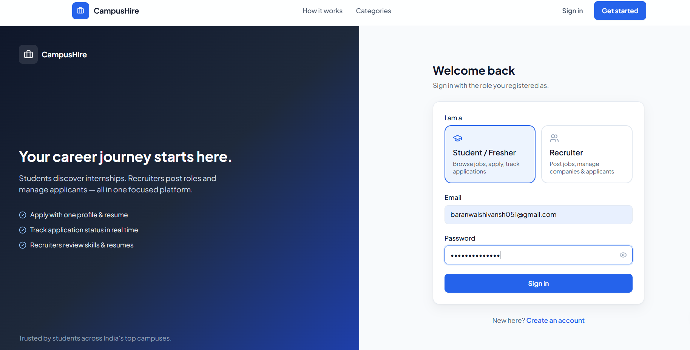

# CampusHire

A full-stack MERN job portal for students, freshers, and recruiters to discover opportunities, manage applications, and streamline hiring workflows.

🌐 Live Demo:  
https://job-tracker-ten-ashen.vercel.app/

---

## Features

### Student Features
- User authentication (JWT + HTTP-only cookies)
- Browse and search jobs
- Apply to jobs
- Track application status
- Update profile
- Upload resume and profile image

### Recruiter Features
- Recruiter dashboard
- Create and manage companies
- Post and manage jobs
- View applicants
- Update application status

### Platform Features
- Role-based access control
- Protected frontend routes
- Responsive UI
- Cloudinary file uploads
- Toast notifications and loading states

---

## Tech Stack

### Frontend
- React.js
- Vite
- Tailwind CSS
- Redux Toolkit
- React Router DOM
- Axios
- Framer Motion

### Backend
- Node.js
- Express.js
- MongoDB
- Mongoose
- JWT Authentication
- Multer
- Cloudinary

### Deployment
- Frontend: Vercel
- Backend: Node.js API
- Database: MongoDB Atlas

---

## Project Structure

job-tracker/
├── frontend/
├── backend/
│   ├── src/
│   │   ├── config/
│   │   ├── controllers/
│   │   ├── middleware/
│   │   ├── models/
│   │   ├── routes/
│   │   └── utils/
│   ├── server.js
│   └── package.json
└── README.md
---

## Environment Variables

### Backend (backend/.env)

PORT=5000

MONGO_URI=your_mongodb_uri

SECRET_KEY=your_secret_key

CLOUD_NAME=your_cloudinary_cloud_name
API_KEY=your_cloudinary_api_key
API_SECRET=your_cloudinary_api_secret

CLIENT_URL=http://localhost:5173
### Frontend (frontend/.env)

VITE_API_URL=http://localhost:5000/api/v1
---

## Local Setup

### Clone Repository

git clone https://github.com/baranwalshivansh/job-tracker.git
cd job-tracker
---

### Backend Setup

cd backend
npm install
npm run dev
Backend runs on:

http://localhost:5000
---

### Frontend Setup

cd frontend
npm install
npm run dev
Frontend runs on:

http://localhost:5173
---

## Authentication

- JWT Authentication
- HTTP-only cookies
- Role-based authorization
- Protected routes for students and recruiters

---
## Screenshots

### Home Page

### Login Page

### Jobs Page

### Recruiter Dashboard

---

## Future Improvements

- Email notifications
- Saved jobs
- OAuth login
- Advanced filtering
- Admin dashboard
- Real-time notifications

---

## Connect with Me

Shivansh Baranwal

- GitHub: [@baranwalshivansh](https://github.com/baranwalshivansh)
- LinkedIn: [Shivansh Baranwal](https://www.linkedin.com/in/shivansh-baranwal-203b9737a)
- Email: [baranwalshivansh051@gmail.com](mailto:baranwalshivansh051@gmail.com)

---

Built as a portfolio-ready MERN job portal project with recruiter and student workflows.